En este repositorio mostraré toda la información relativa a mi **Proyecto de Desarrollo de Aplicaciones Web de un sistema de reserva de libros**.

---

# biblioteca_reservas_libros

#### Curso Escolar 2023-2024
#### Autor: [Carlos Sanchez Roman](https://github.com/Csanrom1702)
#### Tutor: [Antonio Gabriel González Casado](https://github.com/antonio-gabriel-gonzalez-casado)
#### Fecha de Inicio: 29-09-2023
#### Fecha de Finalización: 03-10-2023


---

## Descripción del proyecto

Esta es una aplicación web dedicada a la reserva de libros de una biblioteca. Mi programa consiste en un proyecto java, un proyecto javascript y una página de estilos css. 

+ El proyecto java tiene 4 clases: 

1. La clase EstadoLibro que define el estado de los libros con un enum.
2. La clase Libro que define los parámetros que van a tener los libros, los getters and setters y los toString.
3. La clase Main que es la que tiene el menú de ejecutación de las funcionalidades de la aplicación (mostrar la lista de libros disponibles y reservados, crear la reserva, cancelar la reserva, listar todos los libros reservados y notificar al usuario sobre el resultado de la operación).
4. La clase Reserva que define los parámetros que van a tener las reservas realizadas, los getters y los setters y los toString.

+ El proyecto javascript tiene 3 clases:

1. La clase Libro que define los parámetros que van a tener los libros, los getters and setters y los toString.
2. La clase Main que es la que tiene el menú de ejecutación de las funcionalidades de la aplicación (mostrar la lista de libros disponibles y reservados, crear la reserva, cancelar la reserva, listar todos los libros reservados y notificar al usuario sobre el resultado de la operación).
3. La clase Reserva que define los parámetros que van a tener las reservas realizadas, los getters y los setters y los toString.

---

## Instrucciones de clonar desde el repositorio, configuración en IDE y ejecución en local.

---


Para este apartado hay que seguir la guía que muestro a continuación:

**1. Clonar desde el repositorio**
- Primero abre la interfaz de comandos de tu sistema operativo

-  Navega a la dirección en la que quieres clonar tu código.
Puedes navegar por tus directorios con el siguiente comando:

```
cd ~
```
- Utiliza el comando git clone para clonar de mi repositorio de la siguiente forma:

```
git clone https://github.com/Csanrom1702/UD01_3_Despliegue_Carlos_Sanchez_Roman.git
```

Esto hará que se empiece a clonar el repositorio en la carpeta que has asignado anteriormente

- Una vez termine, puedes entrar a la carpeta de destino de la siguiente manera:

```
cd UD01_3_Despliegue_Carlos_Sanchez_Roman
```

**2. Configuración en IDE**

1. **Desplegar proyecto Java en Eclipse**

- Abre el entorno de desarrollo Eclipse

- Una vez abierto, click en File/Import :arrow_down:

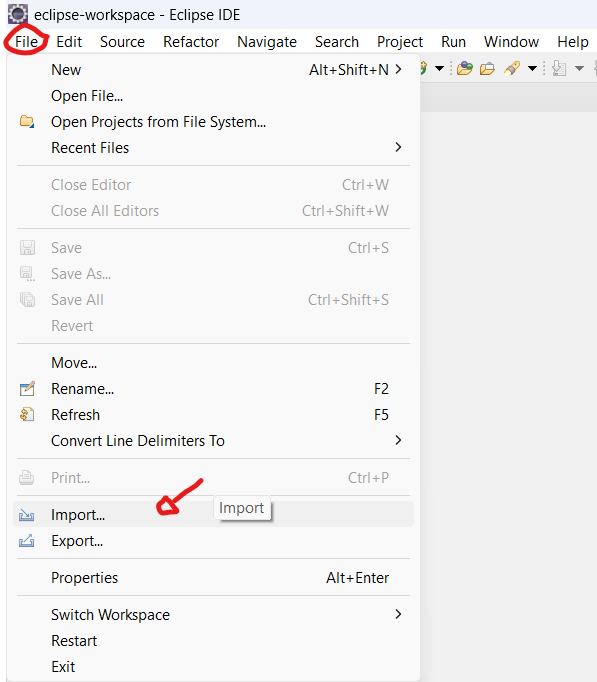

- Seleccionaremos la opción de "Archive file" y le daremos a next

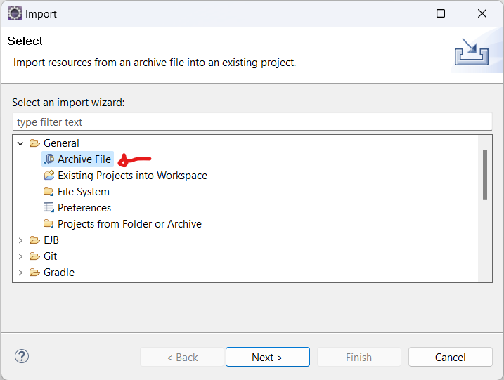

- Se nos abrirá la ventana de importación, en la que tenemos que pulsar sobre "Browse..." para decirle al programa de dónde queremos importar

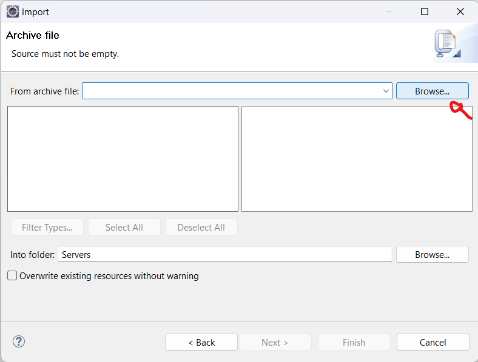

- Seleccionamos la ruta de la que queremos importar el archivo (En mi caso es "Descargas") y le damos a Abrir:

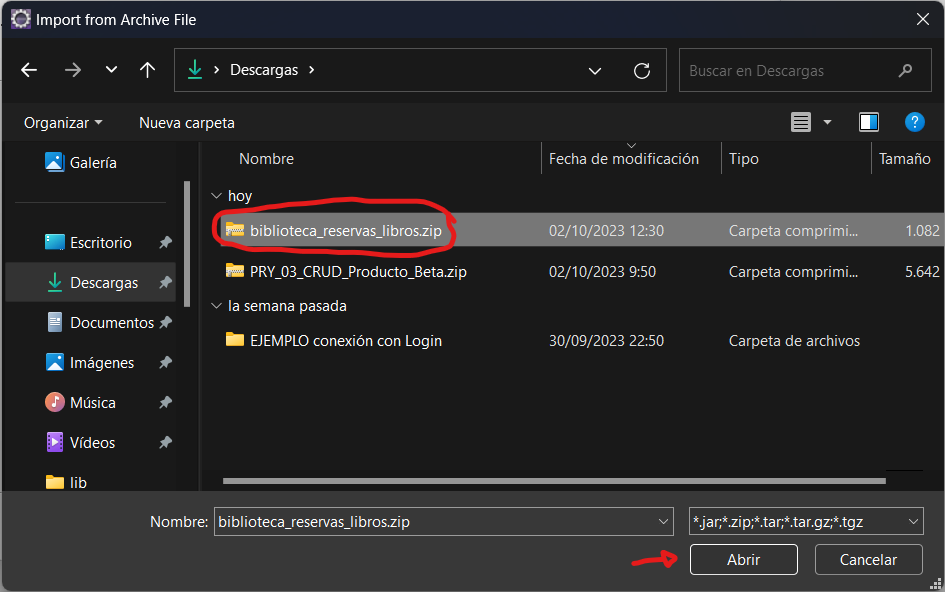

- Pulsamos en finish para terminar la importación del proyecto java

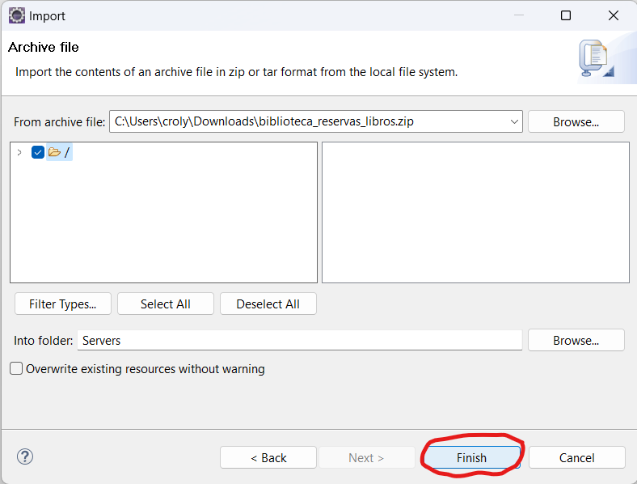

- Y ya estaría importada la parte de java del proyecto de reserva de libros

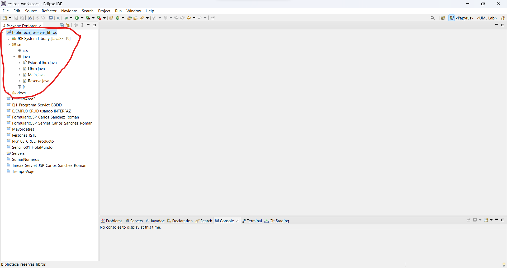

1. **Desplegar proyecto Javascript en Visual Studio Code**

- Abre el explorador de archivos y ubícate en la carpeta en la que tengas el archivo .zip

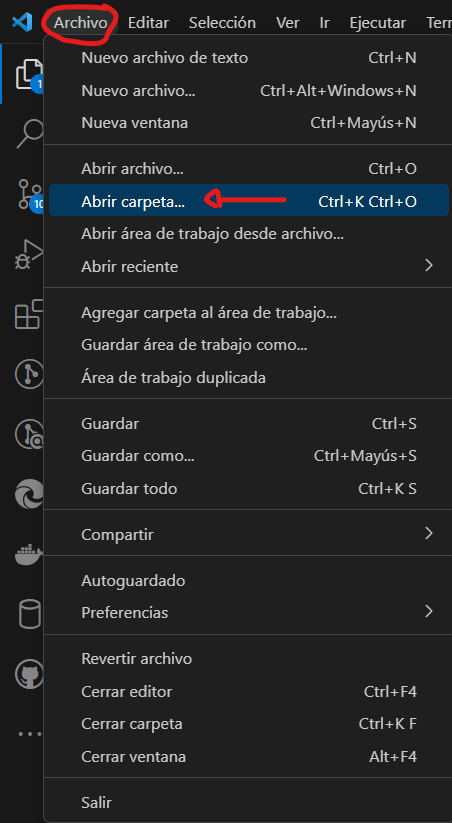

- Haz click derecho sobre el archivo y pulsa "Extraer todo"

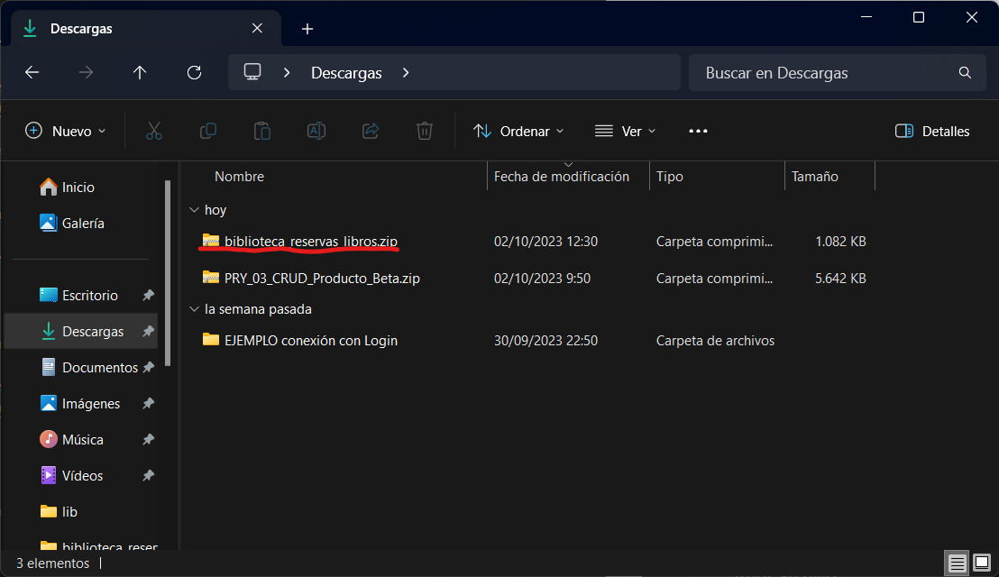

- Pulsa en el botón "Extraer"

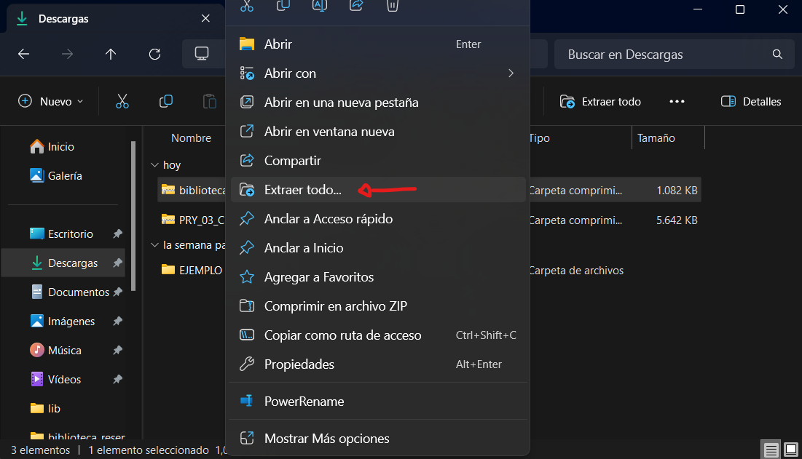

- Abre el entorno de desarrollo Visual Studio Code.

- Pulsa sobre "Archivo/Abrir carpeta"

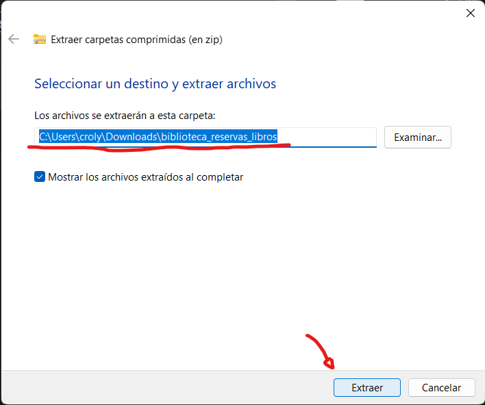

- Selecciona la carpeta que hemos extraído anteriormente:

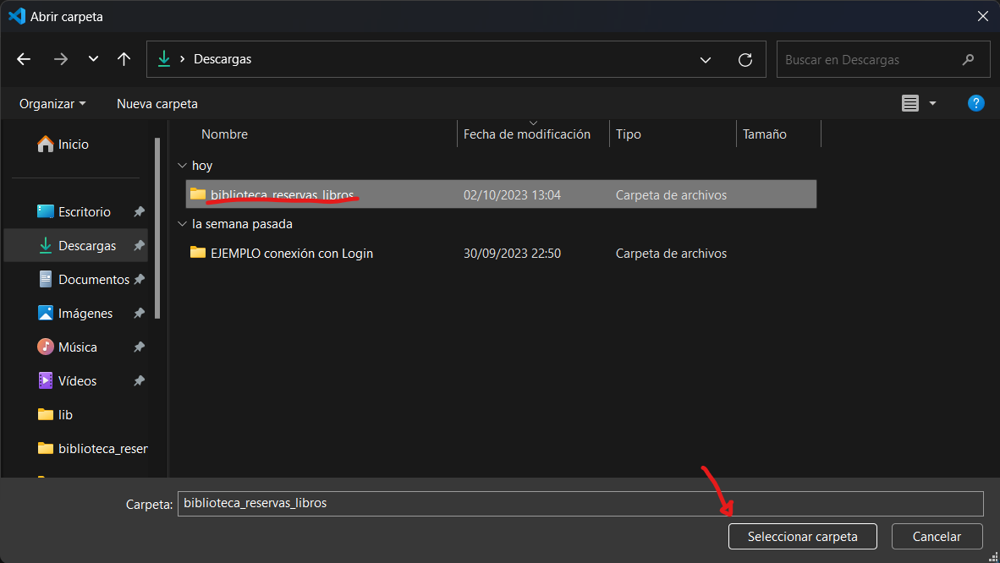

- Y ya tendríamos el proyecto abierto en Visual Studio Code

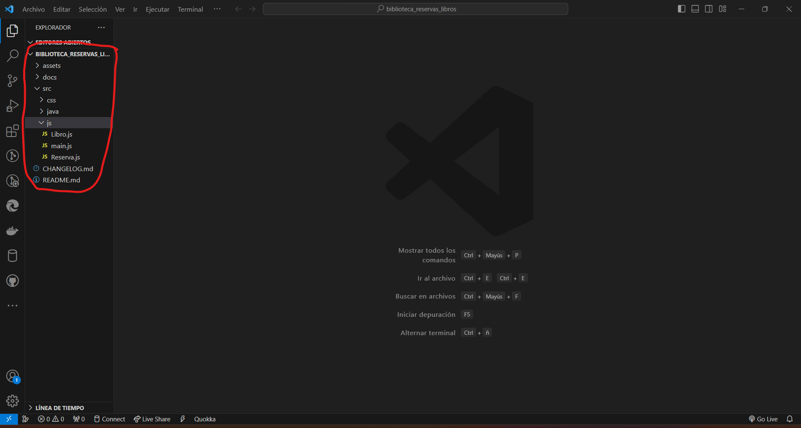

## Enlaces a la documentación generada.

Enlace al Javadoc: [index_de_javadoc](/biblioteca_reservas_libros/docs/javadoc/index.html)

Enlace al JSDoc: [index_de_jsdoc](/biblioteca_reservas_libros/docs/jsdoc/index.html)

Enlace al CSS: [css_documentado](/biblioteca_reservas_libros/src/css/styles.css)

--- 

## Comandos utilizados para generar la documentación.

Los comandos utilizados para generar la documentación son los siguientes:

- **Javadoc**

```
javadoc -d docs EstadoLibro.java Libro.java Reserva.java Main.java
```

- **JSDoc**

```
npm install -g jsdoc (En caso de no tener instalado JSDoc globalmente)

jsdoc Reserva.js main.js Libro.js
```


---

## Estructura de directorios en formato árbol.

└── biblioteca_reservas_libros
    └── CHANGELOG.md
    └── docs
      └── javadoc
          ├──  index.html
      └── jsdoc
          ├──  index.html
    └── README.md
    └── src
      └── css
          ├── styles.css
      └── java
          ├── EstadoLibro.java
          ├── Libro.java
          ├── Main.java
          ├── Reserva.java
      └── js
          ├── Libro.js
          ├── main.js
          ├── Reserva.js
